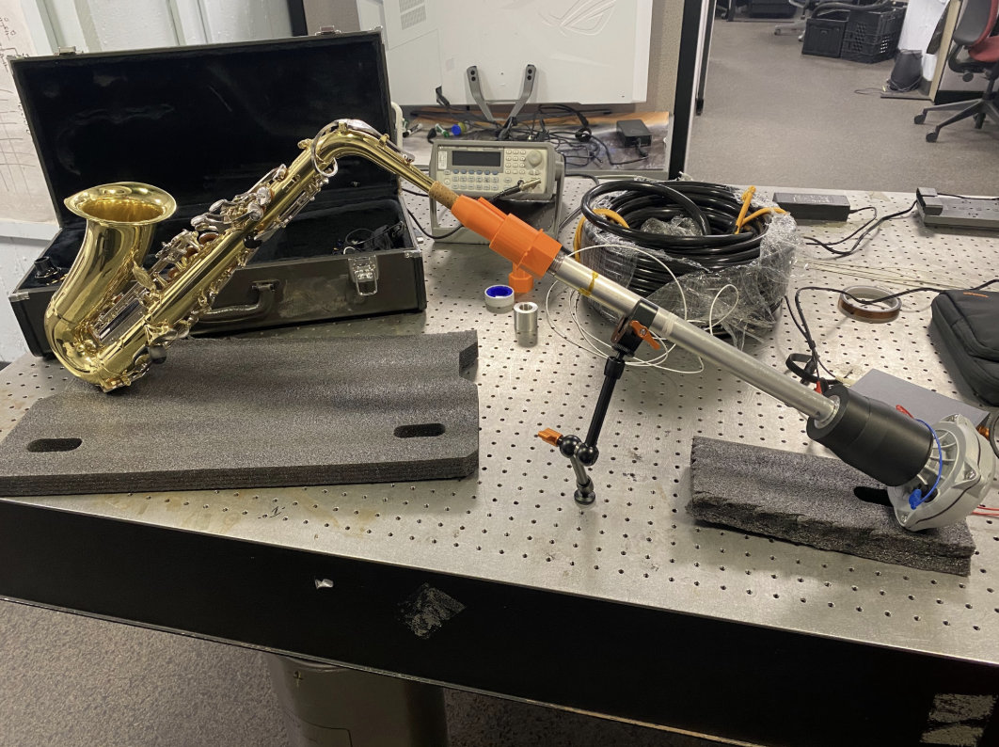
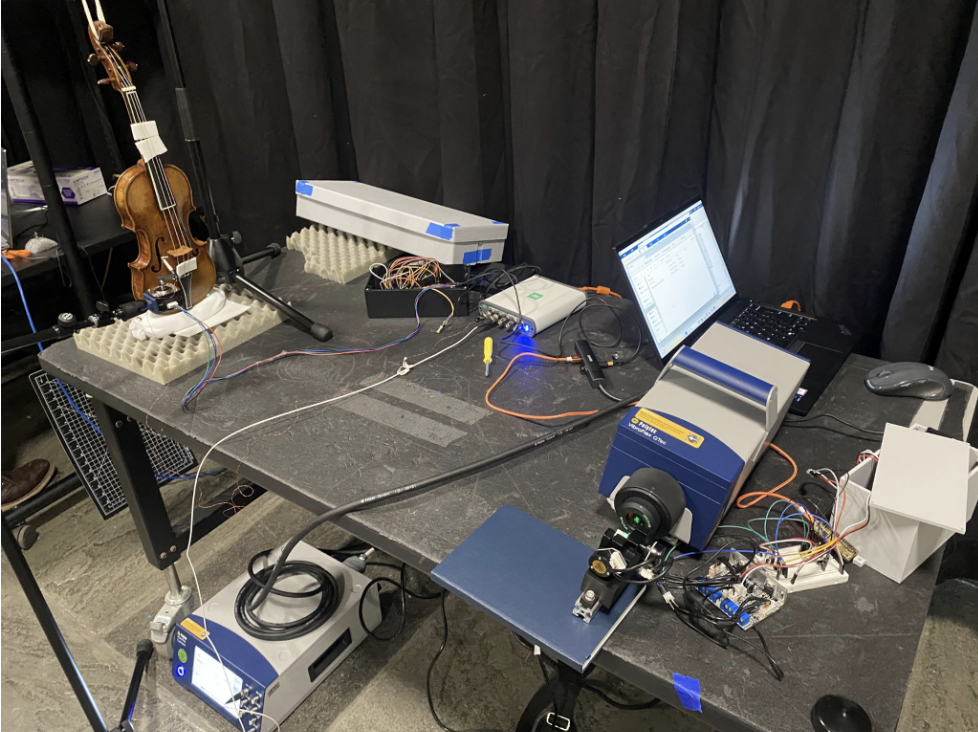
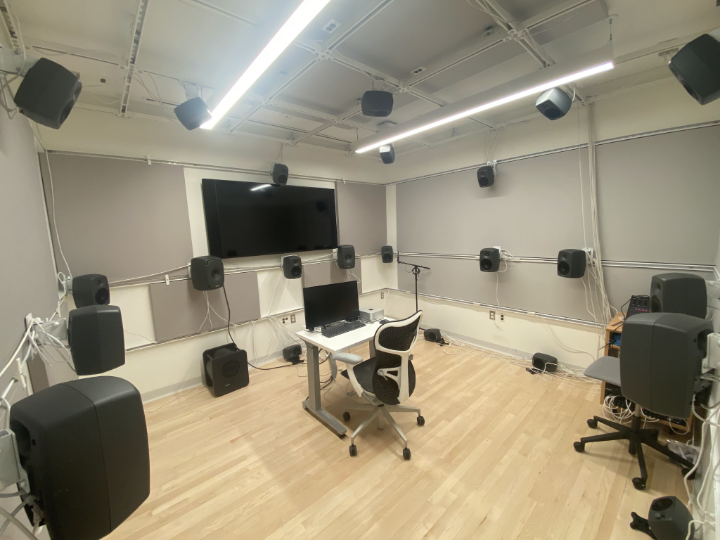
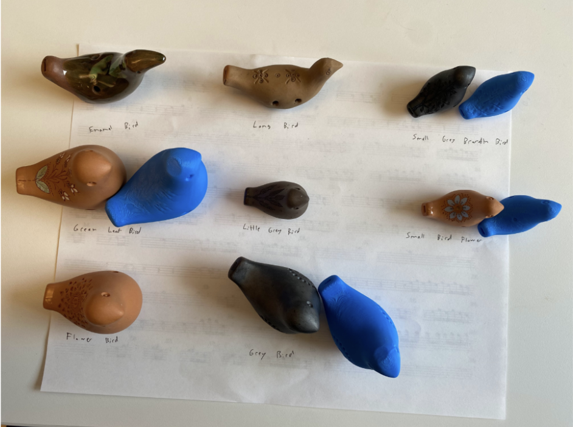

# Lab Equipment and Facilities

Our lab maintains a unique combination of facilities and equipment.

### Acoustic Measurement and Simulation

Our lab has a laser vibrometer and robotic arm that
are used for making acoustic measurements, as well as
a COMSOL machine for performing acoustic simulations.

​
​

### Spatial Audio

We maintain a 26.2 channel studio that can accomodate 7.1.4
surround sound, and is capable of rendering 4th-order ambisonics.

​

### Makerspace

Our music technology makerspace is great for building custom
measurement equipment, studio equipment, and even 3D-printed
instruments.

​
